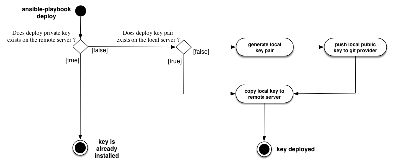

===================================
Bitbucket Credential Ansible Module
===================================

:ABOUT: Generate ssh key pair, deploy private key on remote server and add public key to bitbucket's deploy-keys

Vars
====

::

  {
    bitbucket_key_name: "<name_for_ssh_key_pair>"
    bitbucket_email: "<mail_for_ssh_key_pair>"
    bitbucket_user: "<user>"
    bitbucket_password: "<password>"
    bitbucket_owner: "<owner_of_the_repository>"
    bitbucket_project: "<repository_name>"
  }

/!\\ *For obvious security reasons, avoid storing your bitbucket password.
For instance, use ansible-deploy -e "bitbucket_user=<user> bitbucket_password=<password>" and make sure it's not stored in your history with HISTCONTROL or HISTIGNORE.*

Process
========

Notes:
~~~~~~

- It doesn't create a new key-pair if the remote server already has a private key with <bitbucket_key_name>

- Create a new key pair if you're deploying on a machine that doesn't have already has the key pair in /path/to/project/files/<bitbucket_key_name>. The key pair is not saved in /path/to/project/roles/bitbucket_cred/files.

- bitbucket deploy key is named like this: ``BPK:${bitbucket_user}@${bitbucket_project}_${timestamp}``
